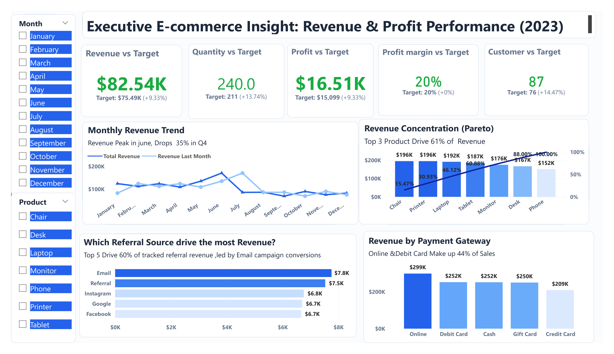

# Executive E-Commerce Insight: Revenue & Profit Performance (2023)
A strategic Business Intelligence solution built in **Microsoft Power BI** to analyze sales performance, profitability, and customer acquisition.



---
## 📌 Project Overview
This project goes beyond standard metric tracking. It implements enterprise-grade analytical frameworks—including target variance benchmarking, Pareto concentration analysis, and acquisition channel evaluation—to surface the insights that actually drive decisions. 
The result is a single-page executive dashboard that answers not just *what* happened in 2023, but *why* it matters and *where* to act next.
### Key Performance Results (2023)

| Metric | Actual | Target | Variance | Status |
| :--- | :--- | :--- | :--- | :--- |
| **Revenue** | $82.54K | $75.89K | +9.33% | ✅ |
| **Quantity Sold** | 240 units | 211 units | +13.74% | ✅ |
| **Profit** | $16.51K | $15.09K | +9.33% | ✅ |
| **Profit Margin** | 20% | 20% | On Target | ✅ |
| **Active Customers** | 87 | 76 | +14.47% | ✅ |

> **Note:** All five KPIs exceeded or met targets for the full year.
---
## 📊 Strategic Insights
1. **Broad Target Outperformance:** Annual revenue exceeded forecasts by 9.33%, driven significantly by customer acquisition outperforming its baseline by 14.47%. This suggests the top-of-funnel strategy was well-calibrated.
2. **Q4 Revenue Contraction (-35%):** Revenue peaked in June before declining sharply through Q4. This seasonal pattern signals a clear opportunity for year-end promotional strategy, targeted retention campaigns, or bundled product offers timed for Q3-Q4.
3. **Portfolio Concentration Risk:** Three product lines — *Chairs, Printers, and Laptops* — account for 61% of total revenue. While this concentration reflects strong performers, it creates dependency risk. Cross-selling Tablets, Monitors, and Phones represents a tangible diversification opportunity.
4. **Email & Referral Dominate Acquisition:** Email campaigns ($7.8K) and organic referrals ($7.5K) outperformed every paid channel, including Facebook and Instagram (both at $0.7K). This indicates high ROI from owned and earned channels relative to paid social spend.
5. **Online Payment Leads at $299K:** Online transactions account for the largest payment volume, with Debit Card and Cash closely behind at $252K each. Combined, Online and Debit Card make up 44% of total sales volume — pointing to a digitally-engaged customer base.
---
## 🛠️ Analytical Frameworks Applied
* **Target Variance Analysis:** KPI cards display both absolute values and % deviation from targets, enabling immediate performance diagnosis.
* **Pareto 80/20 Concentration Analysis:** Cumulative revenue distribution across product lines identifies the vital few driving the majority of results.
* **Acquisition Funnel Benchmarking:** Referral source revenue comparison surfaces channel efficiency beyond raw traffic volume.
* **Dynamic Narrative Headers:** Chart subtitles communicate the data story dynamically (e.g., *"Revenue Peak in June, Drops 35% in Q4"*) rather than using generic visual labels.
---
## 💻 Tech Stack & Architecture
### Tool Application
* **Microsoft Power BI Desktop:** Dashboard design, publishing, and interactivity.
* **Power Query (M Language):** Data transformation, cleansing pipeline, and optimization.
* **DAX (Data Analysis Expressions):** Advanced KPI measures, target variance calculations, cumulative Pareto totals, time intelligence, and running totals.
### Data Model
The data architecture follows a **Star Schema** pattern to ensure efficient filtering across slicers and scalable extension for future dimensions.
* `1` Fact table: Transactional sales records.
* `4` Dimension tables: `Products`, `Dates`, `Customers`, and `Channels`.
### Dataset Scope
* **Source:** Synthetic e-commerce transactional dataset.
* **Scope:** January – December 2023 (full year).
* **Grain:** Individual order-level transactions.
---
## 🚀 How to Explore This Project
1. **Clone the Repository:**
   ```bash
   git clone [https://github.com/komobolaji20-droid/Executive-E-Commerce-Insight-Revenue-Profit-Performance-2023-.git](https://github.com/komobolaji20-droid/Executive-E-Commerce-Insight-Revenue-Profit-Performance-2023-.git)
